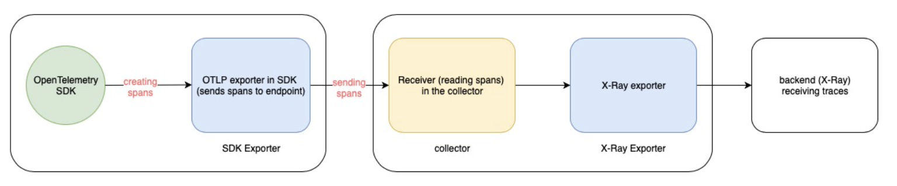
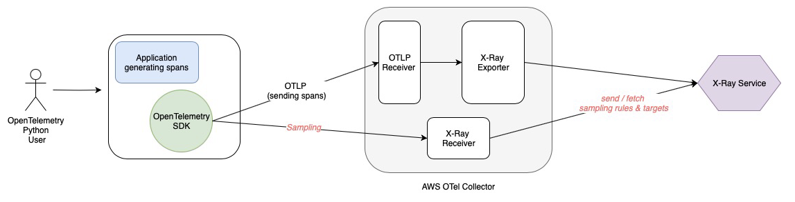

# Centralized Sampling in OpenTelemetry Python - Carol Abadeer ([carolabadeer](https://github.com/carolabadeer)) Proposal

## Problem Statement 

### What is Sampling?

[Sampling](https://github.com/open-telemetry/opentelemetry-specification/blob/main/specification/trace/sdk.md#sampling) is a mechanism to provide a specific number of the requests that are traced and sent to the backend (for example, X-Ray). This is a method for customers to select a certain amount of traces being produced by their application to observe their behavior more closely, which becomes increasingly beneficial as projects grow in size.  

Localized sampling does not provide the customer with flexibility on their sampling preferences. For instance, with localized sampling, the requests being sent from an application are either always sampled, never sampled, or sampled at a fixed rate. Centralized sampling allows the user to control sampling on various hosts and services, as well as configure sampling rules (even after sampling has begun) that contain more refined details and options. 


### The Problem

The AWS X-Ray Python SDK (see Appendix 1) includes support for a remote service to coordinate sampling by giving sampling rules to clients. While this feature is included in the X-Ray SDK, the OpenTelemetry Python SDK does not include support or implementation for X-Ray centralized (remote) sampling. 

This feature addition is important to ensure a consistent user experience of OpenTelemetry Python, which only provides two types of [localized samplers](https://opentelemetry-python.readthedocs.io/en/stable/sdk/trace.sampling.html): Static Sampler and Trace ID Ratio Based Sampler. Both of these samplers do not take into account sampling rules provided by the user since they always return the same results (always on, always off) or make a random sampling result respectively. Similarly, both of these samplers do not accept custom sampling rules from the user.

Centralized sampling will enable customers to have more control over the amount of requests being traced in their application by defining sampling behaviors on an aggregated set of application instances. 


## Goal 

The main goal of this project is to implement centralized sampling in the OpenTelemetry Python SDK to enable X-Ray customers using OpenTelemetry Python SDK to leverage centralized sampling in their applications. Since centralized sampling is already implemented in the X-Ray Python SDK, we want users to be able to [specify sampling rules in the X-Ray console](https://docs.aws.amazon.com/xray/latest/devguide/xray-console-sampling.html) and sample based on those rules when they set X-Ray as their backend while using OpenTelemetry Python.


## Proposed Solution

The proposed solution to implement centralized sampling in the OpenTelemetry Python SDK by adding a sampler that uses an HTTP client to fetch sampling rules and targets set by the user from the central X-Ray service. 

### **Current OpenTelemetry SDK**



Figure 1 - *In-depth diagram of communication between exporters and collectors* 


### Solution

The AWS X-Ray receiver and X-Ray exporter are already implemented as part of the AWS OpenTelemetry Collector and they facilitate the sending of OpenTelemetry spans to X-Ray in a format that can be understood by X-Ray.

* The [AWS X-Ray receiver](https://github.com/open-telemetry/opentelemetry-collector-contrib/tree/main/receiver/awsxrayreceiver) accepts spans being generated from the customer’s application. These spans are sent to the receiver from the OpenTelemetry SDK, and the receiver enables the AWS OpenTelemetry Collector to receive these spans. The X-Ray receiver also supports centralized sampling (through a local TCP port). 
* The [AWS X-Ray exporter](https://github.com/open-telemetry/opentelemetry-collector-contrib/tree/main/exporter/awsxrayexporter) converts OTel spans (sent from the OpenTelemetry SDK) to[AWS X-Ray Segment Documents](https://docs.aws.amazon.com/xray/latest/devguide/xray-api-segmentdocuments.html), which send information about a segment to X-Ray. The exporter then sends the exported spans directly to X-Ray by using the `PutTraceSegments` API.

The OpenTelemetry Specification contains a [Sampler interface](https://github.com/open-telemetry/opentelemetry-specification/blob/main/specification/trace/sdk.md#sampler) which allows its users to create customer samplers based on information that is available just before a Span was created. The proposed solution is to add a RemoteSampler using the existing sampler interface (see Appendix 4) into the OpenTelemetry Python SDK will allow spans to be sampled and sent to the X-Ray receiver. The customer can select this RemoteSampler by configuring their tracer provider to use it.


The code snippet below demonstrates how a customer would configure their tracer provider to use the proposed remote sampler. Assume that the new sampler has been named `RemoteSampler`

```python
**from** **opentelemetry** **import** trace
**from** **opentelemetry****.****sdk****.****trace** **import** TracerProvider
**from** **opentelemetry****.****sdk****.****trace****.****export** **import** (
ConsoleSpanExporter, SimpleSpanProcessor,
)

from opentelemetry.exporter.otlp.proto.grpc.trace_exporter import OTLPSpanExporter


# import RemoteSampler from the OpenTelemetry SDK
**from** **opentelemetry****.****sdk****.****extension****.****aws****.****trace****.****sampling** **import** AWSXRayRemoteSampler

*# instantiate RemoteSampler*
# endpoint for port running the X-Ray Receiver (default = 2000)
sampler = AWSXRayRemoteSampler(endpoint="http://localhost:2000")

# OTLP exporter 
otlp_exporter = OTLPSpanExporter(endpoint="http://localhost:4317", insecure=True)

processor = SimpleSpanProcessor(otlp_exporter)


*# set the remote sampler onto the global tracer provider*
trace.set_tracer_provider(
TracerProvider(
active_span_processor=processor,
sampler=sampler, 
id_generator=AwsXRayIdGenerator()))

*# created spans will now be sampled by the new RemoteSampler*
**with** trace.get_tracer(__name__).start_as_current_span("Test Span"):
    print("Testing Remote Sampler!")
```

 Since the X-Ray receiver is configured with the user’s AWS credentials to act as a TCP proxy, the SDK can initiate requests to `GetSamplingRules` and `GetSamplingTargets` and route those requests through the receiver. The receiver communicates with the X-Ray service, it can send and fetch sampling rules and targets from the API and send them back to the collector, which acts as a proxy, that will communicate to the hosts. The benefit of using this proxy is that the SDKs no longer need to be configured with AWS credentials since they have been set up in the receiver. This eliminates the need for authentication in the X-Ray service and saves time by sending less requests.  

 This communication includes information about how many requests have been sampled, and how many more requests can be sampled to stay within the limits specified in the sampling rules. The SDK uses the `GetSamplingTargets` API to send its sampling statistics as a request body and receives details about the quota to use in the response by using [this format](https://docs.aws.amazon.com/xray/latest/devguide/xray-api-sampling.html) (see Appendix 3). This quota is valid for 10 seconds, after which this process is repeated to retrieve a new quota.

Similarly, the fetching process will allow X-Ray users to modify their sampling rules and observe the effects of that modification in the spans/traces that are being sampled. This is done through calls to the `GetSamplingRules` API every 5 minutes to fetch and cache centralized sampling rules.

The [X-Ray API docs](https://docs.aws.amazon.com/xray/latest/devguide/xray-api-sampling.html) explain how a sampling decision is made, “Evaluate rules against incoming requests in ascending order of priority. When a rule matches, use the fixed rate and reservoir size to make a sampling decision. Record sampled requests and ignore (for tracing purposes) upsampled requests. Stop evaluating rules when a sampling decision is made”

* *Fixed rate*: a decimal number between 0 and 1, representing the percentage of requests to be sampled. 
* *Reservoir*: A fixed number of matching requests to instrument per second before applying the fixed rate. (For example, the reservoir in the second sampling rule in this example indicates that 2 requests will be instrumented before applying the fixed rate of 0.1%).
* *Borrowed from reservoir*: the number of requests sampled by borrowing from the reservoir.

i

Figure 2 - *Communication Between OpenTelemetry SDK and AWS X-Ray* 


## Appendix 

1. X-Ray SDK 

After generating a segment, the X-Ray SDK makes a sampling decision based on the sampling rules fetched from the X-Ray service. This rule polling is conducted in a background thread that communicates with the [X-Ray Daemon](https://docs.aws.amazon.com/xray/latest/devguide/xray-daemon.html) over TCP. If the SDK determines that this segment will be sampled (based on the rules that were fetched), it is then sent to the X-Ray Daemon over a UDP connection, which in turn sends it to the X-Ray service (by using the `PutTraceSegments` API) for storage.

1. [X-Ray default port number](https://aws-otel.github.io/docs/components/x-ray-receiver#endpoint-optional) (2000)
2. [Sampling Rules and Targets format](https://docs.aws.amazon.com/xray/latest/devguide/xray-api-sampling.html)
3. [Sampler interface](https://github.com/open-telemetry/opentelemetry-python/blob/main/opentelemetry-sdk/src/opentelemetry/sdk/trace/sampling.py) in Python from `opentelemetry-python` repo


